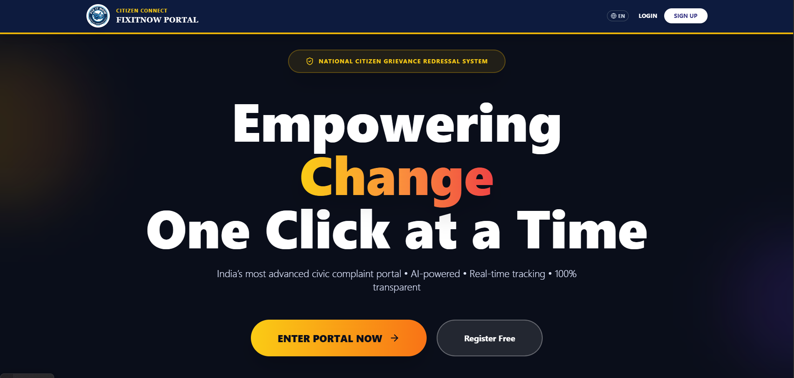
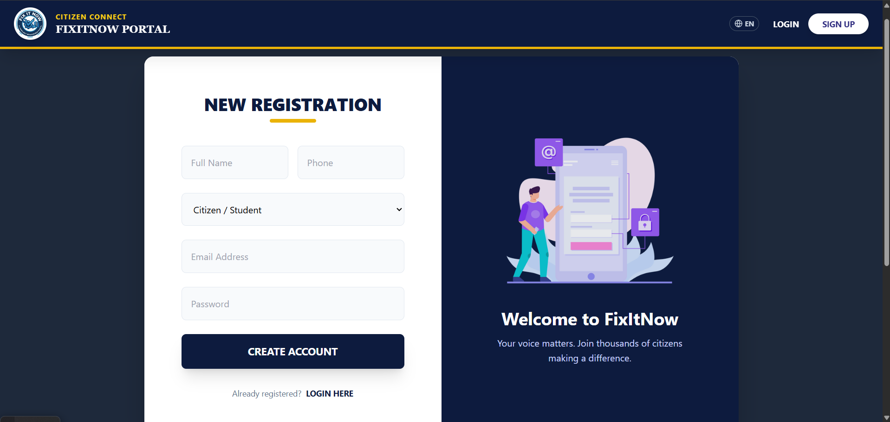
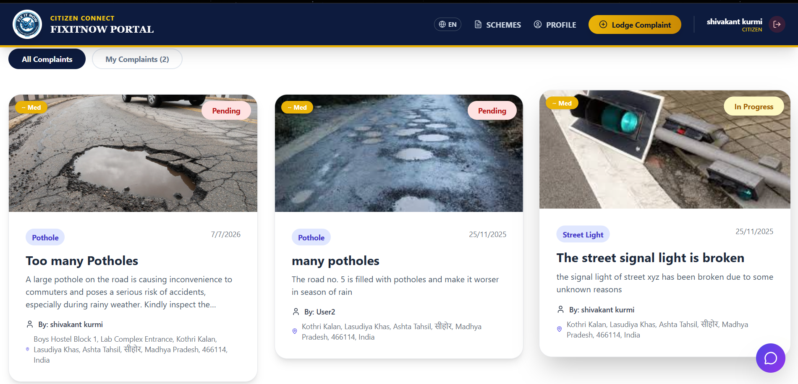
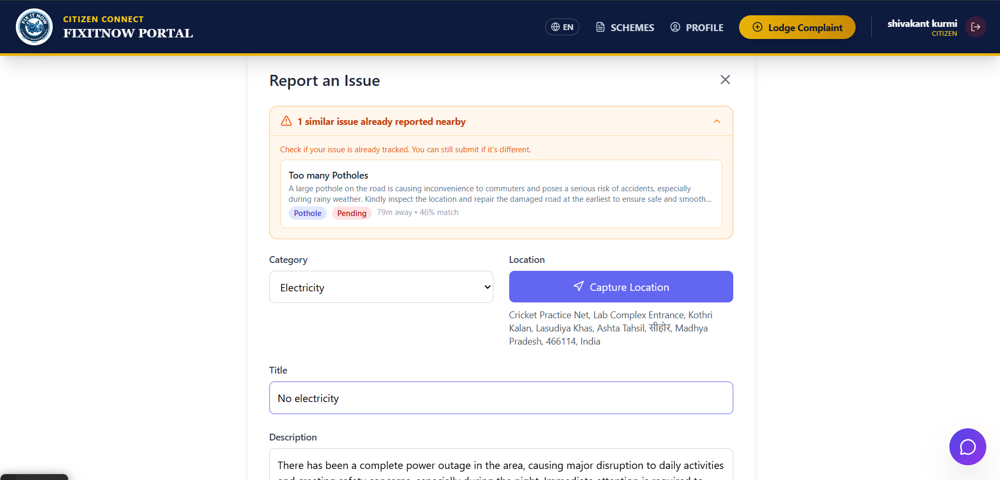
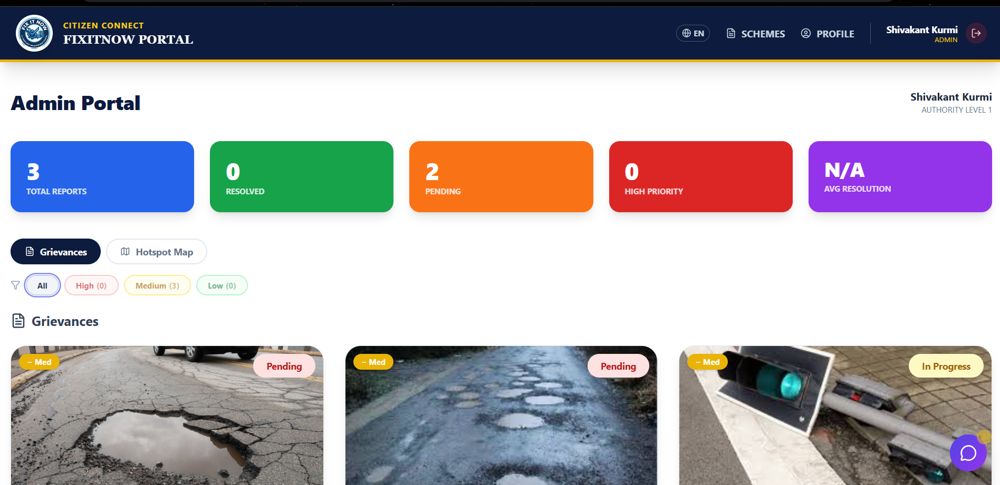
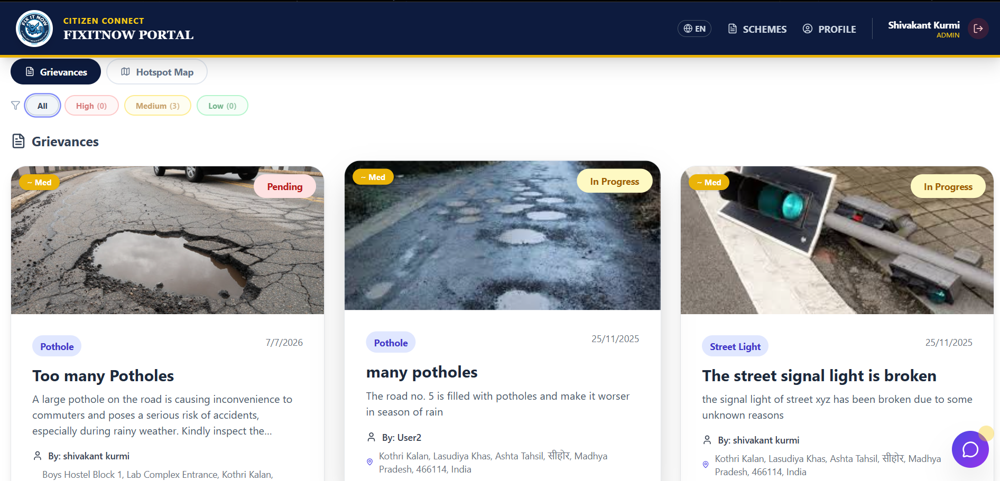
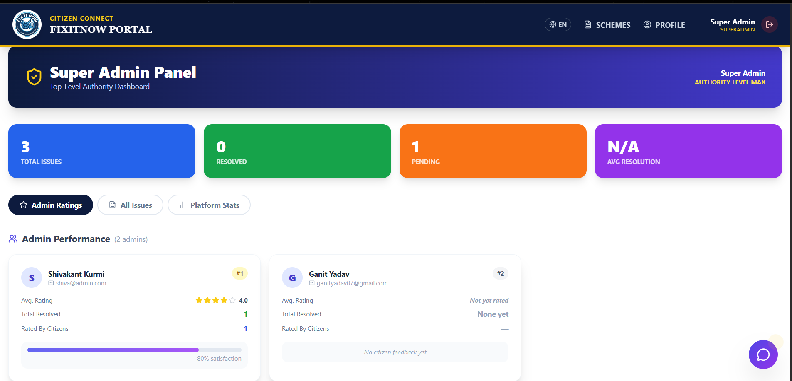
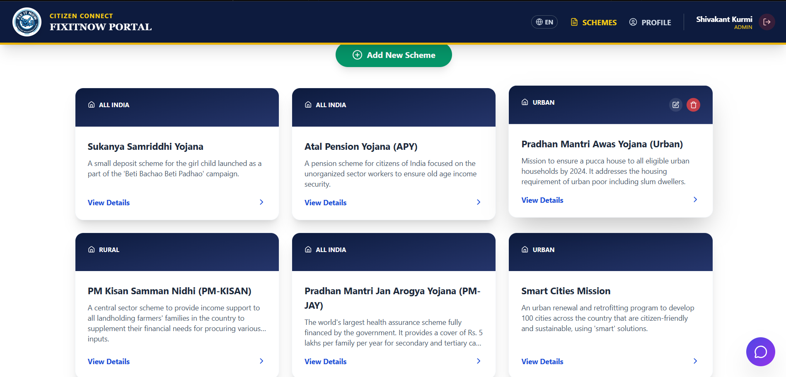

# FixItNow

A full-stack civic grievance portal enabling citizens to report local infrastructure problems and allowing administrators to manage, track, and resolve them. The platform includes a government schemes & local facilities hub, an AI-powered multilingual chatbot, ML-based priority prediction, and a **Super Admin** top-level authority layer that monitors all admin performance via citizen feedback ratings.

---

## Table of Contents

- [Overview](#overview)
- [Screenshots](#screenshots)
- [Tech Stack](#tech-stack)
- [Architecture](#architecture)
- [Project Structure](#project-structure)
- [Data Models](#data-models)
- [Role Hierarchy](#role-hierarchy)
- [API Reference](#api-reference)
- [Authentication & Authorization Flow](#authentication--authorization-flow)
- [Super Admin Setup](#super-admin-setup)
- [Feedback & Admin Ratings](#feedback--admin-ratings)
- [ML Priority Prediction](#ml-priority-prediction)
- [Frontend Architecture](#frontend-architecture)
- [Key Features](#key-features)
- [Environment Variables](#environment-variables)
- [Local Development Setup](#local-development-setup)
- [Deployment](#deployment)

---

## Overview

FixItNow is a three-tier web application:

- **Citizens** register, report civic issues (potholes, garbage, street lights, water leakage, electricity faults), attach photos, share GPS location, track issue status, and rate the resolution quality once an issue is closed.
- **Admins** see all reported issues, update statuses, upload resolution evidence, and view analytics dashboards. Ratings given by citizens after resolution are attributed specifically to the admin who resolved the issue.
- **Super Admin** is a top-level authority account (seeded from `.env` credentials) that has full visibility across the platform — including individual admin performance ratings, resolution counts, and citizen satisfaction scores.

Resolved issues are automatically purged after **24 hours** via a server-side cleanup job.

---

## Screenshots

### Landing Page



*Public home page introducing FixItNow with a call-to-action to register or log in.*

---

### Login / Register



*Authentication page with Login and Register tabs. Includes Google reCAPTCHA bot protection.*

---

### Citizen Dashboard



*Citizens view submitted issues, track status, and leave feedback once an issue is resolved.*

---

### Report an Issue



*Issue submission form — category, photo (up to 15 MB), GPS location, address auto-fill, and ML priority prediction.*

---

### Admin Dashboard



*Admin view showing analytics cards, category breakdown, paginated issue list, and K-Means hotspot map.*

---

### Admin — Update Issue Status



*Admins change issue status and upload resolution evidence.*

---

### Super Admin — Admin Ratings



*Super Admin panel showing per-admin performance: avg citizen rating, resolved count, and satisfaction bar.*

---

### Government Schemes & Facilities



*Info hub listing government schemes and local facilities, filterable by type and region.*

---

## Tech Stack

| Layer            | Technology                                                          |
|------------------|---------------------------------------------------------------------|
| Frontend         | React 19, Vite 7, Tailwind CSS 3, Framer Motion, Lucide React      |
| Backend          | Node.js, Express 5                                                  |
| Database         | MongoDB (via Mongoose 9)                                            |
| Auth             | JWT (jsonwebtoken), bcryptjs                                        |
| Image Upload     | Base64 encoding stored in MongoDB (up to 15 MB)                     |
| Geolocation      | Browser Geolocation API + Nominatim (OpenStreetMap)                 |
| AI Chatbot       | Google Gemini 2.5 Flash (multilingual, multi-turn)                  |
| ML Prediction    | Python FastAPI + scikit-learn RandomForestClassifier + TF-IDF       |
| Notifications    | react-hot-toast                                                     |
| Bot Protection   | react-google-recaptcha                                              |
| Deployment       | Vercel (Frontend & Backend)                                         |

---

## Architecture

```
┌─────────────────────────────────────────────────────────────────┐
│                         CLIENT (Browser)                         │
│                                                                  │
│  ┌──────────┐ ┌────────────────┐ ┌──────────────────────────┐   │
│  │ AuthPage │ │ CitizenDashboard│ │   AdminDashboard         │   │
│  └──────────┘ └────────────────┘ └──────────────────────────┘   │
│  ┌──────────────┐ ┌────────────┐ ┌──────────────────────────┐   │
│  │ ReportIssue  │ │ InfoSchemes│ │  SuperAdminDashboard      │   │
│  └──────────────┘ └────────────┘ └──────────────────────────┘   │
└───────────────────────────┬─────────────────────────────────────┘
                            │ HTTPS (Bearer JWT)
┌───────────────────────────▼─────────────────────────────────────┐
│                       BACKEND  (Express 5)                       │
│                                                                  │
│  /api/auth   /api/issues   /api/analytics   /api/info            │
│  /api/ai     /api/superadmin                                     │
│                                                                  │
│  Middleware: protect / admin / superAdmin                        │
│  Startup:    seedSuperAdmin (from .env, runs once)               │
│  Scheduler:  cleanupResolvedIssues (every 24 h)                  │
└──────────┬────────────────────────────┬────────────────────────-┘
           │                            │
  ┌────────▼────────┐       ┌───────────▼──────────────────┐
  │  MongoDB Atlas  │       │  Python ML Service (FastAPI)  │
  │  users│issues   │       │  POST /predict-priority       │
  │  infos          │       └──────────────────────────────┘
  └─────────────────┘
```

---

## Project Structure

```
FixItNow/
├── Backend/
│   ├── server.js              # Entry point — Express, routes, cleanup, super admin seed
│   ├── vercel.json
│   ├── package.json
│   ├── .env.example
│   ├── config/
│   │   └── db.js
│   ├── middleware/
│   │   └── auth.js            # JWT protect + admin + superAdmin guards
│   ├── models/
│   │   ├── User.js            # citizen / admin / superadmin roles
│   │   ├── Issue.js           # + resolvedBy field for feedback attribution
│   │   └── Info.js
│   ├── routes/
│   │   ├── authRoutes.js
│   │   ├── issueRoutes.js     # sets resolvedBy on Resolved status
│   │   ├── infoRoutes.js
│   │   ├── analyticsRoutes.js
│   │   ├── aiRoutes.js
│   │   └── superadminRoutes.js# admin-ratings, admins list, all issues
│   ├── utils/
│   │   ├── Cleanup.js
│   │   ├── nlp.js
│   │   ├── clustering.js
│   │   └── seedSuperAdmin.js  # one-time seed from .env
│   └── ml_service/
│       ├── main.py
│       └── training_data.json # 1181 labelled samples
│
└── Frontend/
    └── src/
        ├── App.jsx                      # routes superadmin → SuperAdminDashboard
        ├── contexts/LanguageContext.jsx
        ├── utils/translations.js
        └── components/
            ├── LandingPage.jsx
            ├── AuthPage.jsx
            ├── Navbar.jsx               # role-aware home routing
            ├── Footer.jsx
            ├── CitizenDashboard.jsx
            ├── AdminDashboard.jsx
            ├── SuperAdminDashboard.jsx  # NEW — admin ratings + platform stats
            ├── ReportIssue.jsx
            ├── IssueCard.jsx
            ├── InfoSchemes.jsx
            ├── HotspotMap.jsx
            ├── Chatbot.jsx
            └── ProfilePage.jsx
```

---

## Data Models

### User

| Field                | Type     | Notes                                              |
|----------------------|----------|----------------------------------------------------|
| `name`               | String   | Required                                           |
| `email`              | String   | Required, unique                                   |
| `password`           | String   | bcrypt hashed                                      |
| `role`               | String   | `citizen` (default), `admin`, or `superadmin`      |
| `phone`              | String   | Optional                                           |
| `languagePreference` | String   | Default `en`; supports `hi`, `mr`, `bn`            |
| `location.lat/lng`   | Number   | Approximate home location                          |

> `superadmin` accounts cannot be created via the public registration endpoint. Seeded from `.env` only.

### Issue

| Field                   | Type     | Notes                                                        |
|-------------------------|----------|--------------------------------------------------------------|
| `user`                  | ObjectId | Ref → User (reporter)                                        |
| `title`                 | String   | Required                                                     |
| `description`           | String   | Required                                                     |
| `category`              | String   | `Pothole`, `Garbage`, `Street Light`, `Water Leakage`, `Electricity`, `Other` |
| `imageUrl`              | String   | Base64 image (optional)                                      |
| `location.lat/lng`      | Number   | GPS coordinates (required)                                   |
| `location.address`      | String   | From reverse geocoding                                       |
| `status`                | String   | `Pending` → `In Progress` → `Resolved` / `Rejected`         |
| `priority`              | String   | `Low`, `Medium` (default), `High`                            |
| `assignedTo`            | String   | Admin/department (`Unassigned` default)                      |
| `resolutionEvidenceUrl` | String   | Admin-uploaded proof of fix                                  |
| `resolvedAt`            | Date     | Set on Resolved                                              |
| `resolvedBy`            | ObjectId | Ref → User — the specific admin who resolved the issue       |
| `feedback.rating`       | Number   | 1–5 stars (citizen, after Resolved)                          |
| `feedback.comment`      | String   | Citizen text feedback                                        |

### Info

| Field            | Type   | Notes                          |
|------------------|--------|--------------------------------|
| `type`           | String | `Scheme` or `Facility`         |
| `title`          | String | Required                       |
| `description`    | String | Required                       |
| `region`         | String | `All`, `Rural`, or `Urban`     |
| `eligibility`    | String | Scheme-specific                |
| `benefits`       | String | Scheme-specific                |
| `website`        | String | Scheme-specific                |
| `contactInfo`    | String | Facility-specific              |
| `address`        | String | Facility-specific              |
| `operatingHours` | String | Facility-specific              |

---

## Role Hierarchy

```
superadmin  ←  Top-level authority (seeded from .env only)
    │           Views: admin ratings, all issues, platform stats
    │
   admin     ←  Resolves issues; admin rating tracked via citizen feedback
    │           Views: all issues, analytics, hotspot map
    │
 citizen     ←  Default public role
                Views: report issues, own issues, rate resolved issues
```

---

## API Reference

### Auth  `/api/auth`

| Method | Endpoint    | Auth   | Description                                    |
|--------|-------------|--------|------------------------------------------------|
| POST   | `/register` | Public | Create citizen or admin account                |
| POST   | `/login`    | Public | Authenticate; receive JWT                      |
| GET    | `/verify`   | Bearer | Validate token                                 |
| GET    | `/profile`  | Bearer | Get current user profile                       |
| PUT    | `/profile`  | Bearer | Update profile                                 |

### Issues  `/api/issues`

| Method | Endpoint            | Auth              | Description                                    |
|--------|---------------------|-------------------|------------------------------------------------|
| POST   | `/`                 | Citizen / Admin   | Create issue                                   |
| GET    | `/`                 | Any logged-in     | List all issues (paginated, filterable)        |
| GET    | `/my`               | Any logged-in     | Own issues                                     |
| GET    | `/:id`              | Any logged-in     | Single issue                                   |
| PUT    | `/:id/status`       | Admin / SuperAdmin| Update status; sets `resolvedBy` on Resolved   |
| DELETE | `/:id`              | Owner             | Delete own non-resolved issue                  |
| PUT    | `/:id/feedback`     | Issue owner       | Submit rating + comment                        |
| POST   | `/check-duplicate`  | Any logged-in     | NLP + Geo duplicate detection                  |
| POST   | `/predict-priority` | Any logged-in     | ML priority prediction                         |

### Analytics  `/api/analytics`

| Method | Endpoint    | Auth              | Description                         |
|--------|-------------|-------------------|-------------------------------------|
| GET    | `/dashboard`| Admin / SuperAdmin| Counts, categories, avg resolution  |
| GET    | `/hotspots` | Admin / SuperAdmin| K-Means clusters + raw points       |

### Info  `/api/info`

| Method | Endpoint  | Auth  | Description                    |
|--------|-----------|-------|--------------------------------|
| GET    | `/`       | Public| List schemes/facilities        |
| POST   | `/`       | Admin | Create entry                   |
| PUT    | `/:id`    | Admin | Update entry                   |
| DELETE | `/:id`    | Admin | Delete entry                   |

### Super Admin  `/api/superadmin`

| Method | Endpoint         | Auth       | Description                                       |
|--------|------------------|------------|---------------------------------------------------|
| GET    | `/admin-ratings` | SuperAdmin | Per-admin avg rating, resolved count, ratedCount  |
| GET    | `/admins`        | SuperAdmin | All admin accounts (no passwords)                 |
| GET    | `/issues`        | SuperAdmin | All issues with resolvedBy populated              |

**Sample `/admin-ratings` response:**
```json
[
  {
    "_id": "...",
    "name": "Ravi Kumar",
    "email": "ravi@corp.in",
    "totalResolved": 38,
    "avgRating": 4.21,
    "ratedCount": 24
  }
]
```

---

## Authentication & Authorization Flow

```
Login → JWT (30d) → stored in localStorage
Every request → Authorization: Bearer <token>
    → protect: verifies JWT, loads req.user
    → admin: allows role admin OR superadmin
    → superAdmin: allows role superadmin only

Frontend routing by role:
  citizen    → CitizenDashboard
  admin      → AdminDashboard
  superadmin → SuperAdminDashboard

Startup: GET /api/auth/verify re-checks token;
         401 → auto-logout
```

---

## Super Admin Setup

Set these three variables in `Backend/.env` before starting the server:

```env
SUPERADMIN_EMAIL=superadmin@fixitnow.gov.in
SUPERADMIN_PASSWORD=ChangeMe@123
SUPERADMIN_NAME=Super Admin
```

`utils/seedSuperAdmin.js` runs automatically after the DB connects on every startup:

| Scenario | What happens |
|---|---|
| Email **not found** in DB | Creates the account with `role: 'superadmin'` and logs `Super admin seeded: <email>` |
| Email **exists** but role is not `superadmin` | Upgrades the role to `superadmin` and logs `Super admin role updated for existing user: <email>` |
| Email exists and role is already `superadmin` | No-op — skips silently |

> **Important:** If you previously registered using the same email as `SUPERADMIN_EMAIL` through the normal sign-up flow, the role will be automatically corrected to `superadmin` on the next server restart. No manual DB edits needed.

> Use a strong password. The `.env` file is gitignored.

---

## Feedback & Admin Ratings

1. Admin resolves an issue → `issue.resolvedBy = req.user._id` saved.
2. Citizen rates the resolved issue (1–5 stars + comment).
3. Super Admin calls `/api/superadmin/admin-ratings` → MongoDB aggregation groups `feedback.rating` by `resolvedBy` to compute per-admin averages.

Feedback is attributed to **only the admin who resolved the issue**, not all admins.

---

## ML Priority Prediction

| Detail           | Value                                                          |
|------------------|----------------------------------------------------------------|
| Model            | `CalibratedClassifierCV(LinearSVC, cv=5)` — calibrated probabilities |
| Features         | TF-IDF trigrams (3000 features, `min_df=2`) + one-hot category |
| Classes          | `High`, `Medium`, `Low`                                        |
| Training samples | 875 (in `ml_service/training_data.json`)                      |
| CV Accuracy      | **86.7%** (5-fold stratified, up from 83.2% with RandomForest) |
| Endpoint         | FastAPI `POST /predict-priority` on port 5001                  |
| Fallback         | Keyword heuristic in `issueRoutes.js`                          |

---

## Frontend Architecture

### View Routing

```
'landing'    → LandingPage
'dashboard'  → CitizenDashboard
'admin'      → AdminDashboard
'superadmin' → SuperAdminDashboard
'report'     → ReportIssue
'schemes'    → InfoSchemes
'profile'    → ProfilePage
```

### Image Upload Flow

```
File selected → FileReader.readAsDataURL() → Base64 string
→ JSON body sent to POST /api/issues → stored as imageUrl in MongoDB
→ rendered as 
```

### Geolocation Flow

```
"Capture Location" → navigator.geolocation.getCurrentPosition()
→ Nominatim reverse geocoding → { lat, lng, address } in form state
→ submitted with issue
```

---

## Key Features

- **Three-tier role system** — Citizen, Admin, SuperAdmin with separate dashboards and API guards.
- **Feedback attributed to resolver** — Citizen ratings tied to the individual admin who closed the issue.
- **Super Admin authority** — Seeded from `.env`, blocked from public registration, sees cross-admin performance.
- **Admin ratings leaderboard** — Sorted by avg rating with satisfaction progress bars.
- **ML priority prediction** — RandomForest on 1181 samples; keyword fallback when ML service is offline.
- **NLP duplicate detection** — TF-IDF + Haversine distance before submission.
- **K-Means hotspot map** — Clustering of issue coordinates into an interactive SVG heatmap.
- **Gemini AI chatbot** — Multilingual, multi-turn, grounded with live DB context.
- **JWT persistence + auto-logout** — Token stored in localStorage; re-verified on every app load.
- **Base64 image attachments** — Up to 15 MB evidence photos for both citizens and admins.
- **Real-time analytics** — MongoDB aggregation pipelines.
- **Automated cleanup** — Resolved issues deleted after 24 h by `setInterval` job.
- **Multilingual UI** — EN / HI / MR / BN via context-based translation system.
- **Privacy controls** — Citizens see reporter names only; admins see full contact.
- **Government info hub** — Schemes and facilities managed by admins, visible to all.

---

## Environment Variables

### Backend  (`Backend/.env`)

| Variable              | Description                                                     |
|-----------------------|-----------------------------------------------------------------|
| `PORT`                | Server port (default `8000`)                                    |
| `MONGO_URI`           | MongoDB Atlas connection string                                 |
| `JWT_SECRET`          | Secret for signing/verifying JWT                                |
| `CLIENT_URL`          | Allowed frontend origin for CORS                                |
| `GEMINI_API_KEY`      | Google Gemini API key                                           |
| `ML_SERVICE_URL`      | FastAPI ML service URL (default `http://localhost:5001`)        |
| `SUPERADMIN_EMAIL`    | Super admin email — seeded once on first start                  |
| `SUPERADMIN_PASSWORD` | Super admin password                                            |
| `SUPERADMIN_NAME`     | Super admin display name (default `Super Admin`)                |

### Frontend  (`Frontend/.env`)

| Variable   | Description       |
|------------|-------------------|
| `VITE_URL` | Backend base URL  |

---

## Local Development Setup

### Prerequisites

- Node.js ≥ 18
- Python ≥ 3.10 (optional — keyword fallback available without it)
- MongoDB Atlas cluster or local MongoDB

### Backend

```bash
cd Backend
npm install
cp .env.example .env      # fill in all values
node server.js
# On first start, super admin is auto-created from .env
```

### ML Service (optional)

```bash
cd Backend/ml_service
pip install fastapi uvicorn scikit-learn
uvicorn main:app --port 5001 --reload
```

### Frontend

```bash
cd Frontend
npm install
# Create Frontend/.env  →  VITE_URL=http://localhost:8000
npm run dev
```

---

## Deployment

Both services deploy independently on **Vercel**.

### Backend

Set all env variables (including `SUPERADMIN_*`) in Vercel project settings. `Backend/vercel.json` routes everything through `server.js` via `@vercel/node`.

### Frontend

Set `VITE_URL` to the backend deployment URL. `Frontend/vercel.json` falls back all paths to `index.html` for SPA routing. Run `npm run build`; Vercel serves `dist/` automatically.

### ML Service

Deploy `Backend/api/predict-priority.py` as a Vercel Python serverless function, or host on any Python-capable platform. Set `ML_SERVICE_URL` accordingly.


